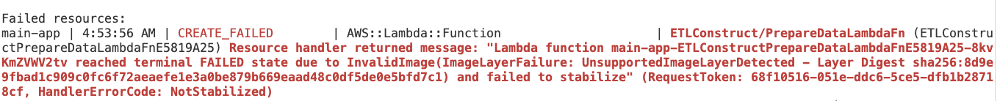

<!-- START doctoc generated TOC please keep comment here to allow auto update -->
<!-- DON'T EDIT THIS SECTION, INSTEAD RE-RUN doctoc TO UPDATE -->

- [Resolve Docker And ECR Push Issues](#01-resolve-docker-and-ecr-push-issues)
    - [Common ECR Push Errors](#common-ecr-push-errors)
    - [Fixing ECR Push Errors](#fixing-ecr-push-errors)
    - [Automating the Deployment](#automating-the-deployment)
    - [Example Shell Script for Building and Pushing Docker Images to ECR](#example-shell-script-for-building-and-pushing-docker-images-to-ecr)
    - [Example Code](#example-code)
- [Deploying The Demo App](#02-deploying-the-demo-app)
    - [Running the CDK Application](#running-the-cdk-application)
    - [Notes:](#notes)
    - [Step 1: Bootstrap the CDK Environment](#step-1-bootstrap-the-cdk-environment)
    - [Step 2: Deploy Demo Application](#step-2-deploy-demo-application)
    - [Step 3: Destroy the Main Stack](#step-3-destroy-the-main-stack)

<!-- END doctoc generated TOC please keep comment here to allow auto update -->

# Resolve Docker And ECR Push Issues


<a name="01-resolve-docker-and-ecr-push-issues01-readmemd"></a>

Step by step guide to resolving Amazon Elastic Container Registry (ECR) issues with Docker Images for CLI and DockerImageFunction



### Common ECR Push Errors

Here are some typical errors you might encounter when pushing images to ECR:

Issue Discussion is here: https://github.com/aws/aws-cdk/issues/31548

These are the steps I took to fix the issue below

- **400 Bad Request Errors - Manifest Issues**:

  ```text
  fail: docker push xyz.dkr.ecr.*.amazonaws.com/cdk-hnb659fds-container-assets-… exited with error code 1: failed commit on ref "manifest-sha256:" … : unexpected status from PUT request to https://xyz.dkr.ecr.*.amazonaws.com/v2/cdk-hnb659fds-container-assets.../manifests/: 400 Bad Request. Failed to publish asset
  ```

- **Lambda Stabilization Failures - InvalidImage**:

  ```text
  Resource handler returned message: "Lambda function ... reached terminal FAILED state due to InvalidImage(ImageLayerFailure: UnsupportedImageLayerDetected - Layer Digest sha256:...) and failed to stabilize" (RequestToken: ..., HandlerErrorCode: NotStabilized)
  ```

---

### Fixing ECR Push Errors

#### 1. Enable Docker BuildKit

##### Set the DOCKER_BUILDKIT environment variable to enable BuildKit

```bash
export DOCKER_BUILDKIT=1
export BUILDKIT_PROGRESS=plain
```

Add these variables to your shell configuration file (e.g., ~/.bashrc, ~/.zshrc, or ~/.profile) to persist the setting.

##### Alternatively, use `docker buildx` instead of `docker build` for extended BuildKit capabilities

**To setup Docker build as a pass-through to Docker Buildx**:
First make sure that you have Docker Buildx installed `docker buildx version`. It's included by default in new versions of Docker Desktop and in Docker Engine.

```bash
alias 'docker build'='docker buildx build'
```

Note: to delete alias `unalias 'docker build'`

Add this alias to your shell configuration file (e.g., ~/.bashrc, ~/.zshrc, or ~/.profile) to persist the setting.

---

#### 2. Clean Up ECR Repositories

- **Prune Local Docker Images**: Remove unused local Docker images with:
  ```bash
  docker system prune --all
  ```
- **Delete Empty Images**: Locate and remove images with 0-byte layers from the ECR registry using the AWS Management Console or AWS CLI.

##### Delete empty images via AWS CLI Script

```bash
is_command_present() {
    type "$1" >/dev/null 2>&1
}

install_jq() {
    printf "\n${YELLOW}PACKAGE CHECK:${NC}Ensuring that you are up to date on the following package: ${RED}jq${NC}\n"

    printf "\n${GREEN}Checking for jq installation.${NC}\n"

    # Check for jq installation
    if is_command_present "jq"; then
        echo "jq is already installed."
    else
        brew install jq
    fi
}

install_jq

##==============================
repositories=$(aws ecr describe-repositories --region $AWS_DEFAULT_REGION --query 'repositories[*].repositoryName' --output text)

for repo in $repositories; do
    echo "\nProcessing repository: $repo"

    # Get the list of image digests in the repository
    image_ids=$(aws ecr list-images --repository-name $repo --region $AWS_DEFAULT_REGION --query 'imageIds[*]' --output json)

    echo $image_ids | jq -c '.[]' | while read -r image; do
        digest=$(echo $image | jq -r '.imageDigest')

        # Get the image details
        image_details=$(aws ecr describe-images --repository-name $repo --image-ids imageDigest=$digest --region $AWS_DEFAULT_REGION)
        #echo "image_details for $tags:\n $image_details"

        # Get all tags for this image
        tags=$(echo $image_details | jq -r '.imageDetails[0].imageTags[]' 2>/dev/null | tr '\n' ',' | sed 's/,$//')

        image_size=$(echo $image_details | jq '.imageDetails[0].imageSizeInBytes')

        echo "\nImage digest: $digest\nRepository name: $repo \nImage tags: $tags"
        # Check if the image size is 0 bytes
        if [ "$image_size" = "0" ]; then
            echo "Image is empty, deleting image with digest $digest"
            aws ecr batch-delete-image --repository-name $repo --image-ids imageDigest=$digest --region $AWS_DEFAULT_REGION

            # Run the AWS ECR delete command
            output=$(aws ecr batch-delete-image --repository-name $repo --image-ids imageDigest=$digest --region $AWS_DEFAULT_REGION)

            # Check for failures or success
            echo "$output" | jq '
            if .failures | length > 0 then
                "Deletion Failure: \(.failures[0].failureReason)"
            else
                "Success: Image deleted"
            end'
        else
            echo "Image Size: $image_size bytes\nImage not empty [image not deleted]"
        fi
    done
done
```

---

#### 3. Create a New ECR Repository Tag for Your ECR Container Docker Image

For Lambda `DockerImageFunction`, AWS CDK automatically manages image tagging and pushing to Amazon ECR. The image is tagged with a hash based on its content, ensuring that changes result in a new tag.

#### Options to Force a New Tag in the ECR Registry

Use one of these approaches to force a new tag, `repeat this step` if you continue to encounter issues with stale or problematic images:

1. **Update the Docker Build Context - IE. Modifying the Lambda Handler Source Code**  
   Modifying files in the Docker build context (many any change to the source code) will trigger a new content-based hash and a new image tag.

2. **Update the Dockerfile**  
   Modifying the `Dockerfile` (e.g., adding or changing `COPY` or `ENV` instructions) will generate a new content hash and tag.

3. **Change the Logical ID of the `DockerImageFunction` in Your CDK Stack**  
   Renaming the logical ID in the CDK stack forces the creation of a new resource, triggering a new image tag even without content changes.

##### Example: Changing the Logical ID of a Lambda `DockerImageFunction`

```typescript
// Old function ID
const prepareDataFn = new cdk.aws_lambda.DockerImageFunction(
  this,
  "PrepareDataLambdaV1Fn",
  {
    code: cdk.aws_lambda.DockerImageCode.fromImageAsset(
      path.join(__dirname, "path-to-docker-build-context")
    ),
  }
);

// New function ID
const prepareDataFn = new cdk.aws_lambda.DockerImageFunction(
  this,
  "PrepareDataLambdaV2Fn",
  {
    code: cdk.aws_lambda.DockerImageCode.fromImageAsset(
      path.join(__dirname, "path-to-docker-build-context")
    ),
  }
);
```

##### Example - Command-Line Docker tagging

Provide a new name for the docker tag.
**Note:** for the cli you tag the image `after` you build it

```bash
docker tag my_image_name:<this_is_my_image_name_tag_here> 241533140213.dkr.ecr.us-east-1.amazonaws.com/cdk-hnb659fds-container-assets-241533140213-us-east-1:<this_is_my_image_name_tag_here>
```

---

#### 4. Disable Metadata Attestations

[Docker Metadata Attestations Documentation](https://docs.docker.com/build/metadata/attestations)
Avoid potential registry configuration issues by disabling provenance and Software Bill of Materials (SBOM) generation:

##### Option 1: Use the `BUILDX_NO_DEFAULT_ATTESTATIONS` Environment Variable

```bash
export BUILDX_NO_DEFAULT_ATTESTATIONS=1
```

##### Option 2: Pass build arguments during the Docker build process to avoid metadata issues during image push

- Set `sbom` to false.

- Set the `provenance` build argument to false.

##### Example Command-Line Build

```bash
DOCKER_BUILDKIT=1 docker build -t my_image_name --provenance=false --sbom=false .
```

##### Modify Lambda Function Build Settings in CDK to remove metadata

If using AWS CDK for Lambda deployments, include the `provenance` and `sbom` arguments in the buildArgs for your `DockerImageFunction`.

```typescript
import * as path from "path";
import * as cdk from "aws-cdk-lib";

const prepareDataFn = new cdk.aws_lambda.DockerImageFunction(
  this,
  "PrepareDataLambdaV1Fn",
  {
    code: cdk.aws_lambda.DockerImageCode.fromImageAsset(
      path.join("../../", "etl/prepare_data"),
      {
        platform: cdk.aws_ecr_assets.Platform.LINUX_ARM64,
        file: "Dockerfile",
        buildArgs: {
          provenance: "false",
          sbom: "false",
        },
      }
    ),
    architecture: cdk.aws_lambda.Architecture.ARM_64,
    description: `Prepare/Clean data - [${cdk.Stack.of(this).stackName}]`,
    timeout: cdk.Duration.minutes(15),
    memorySize: 1024,
  }
);
```

---

### Automating the Deployment

Automate your deployment process using a package.json configuration to:

- Automatically log into ECR
- Automatically set DOCKER_BUILDKIT=1

#### `package.json configuration`

**Note: Example `package.json` [Works on mac/linux, uses `sh`]:**

```json
{
  "scripts": {
    "predeploy": "aws ecr get-login-password | docker login --username AWS --password-stdin $(aws sts get-caller-identity --query 'Account' --output text).dkr.ecr.${AWS_DEFAULT_REGION}.amazonaws.com",
    "deploy": "DOCKER_BUILDKIT=1 sh -c 'cd my_cdk_stacks && npm run cdk deploy -- -c stack_name=\"${STACK_NAME:-}\" --all --require-approval never'",
    "destroy": "npm run cdk destroy -- -c stack_name=\"${STACK_NAME:-}\" --all"
  }
}
```

**CDK Deployment Command:**

```bash
BUILDKIT_PROGRESS=plain CDK_VPC_ID=vpc-09f66ffff5d2773de STACK_NAME=MoyaTestStack npm run deploy
```

---

### Example Shell Script for Building and Pushing Docker Images to ECR

```bash
## Set variables
IMAGE_NAME="moya_test_image"
TAG="moya_test_image_tag"

REGION=$(aws configure get region --profile "${AWS_PROFILE}")
ACCOUNT_ID=$(aws sts get-caller-identity --query 'Account' --output text)

REPOSITORY_NAME="cdk-hnb659fds-container-assets-${ACCOUNT_ID}-${REGION}"

REGISTRY="${ACCOUNT_ID}.dkr.ecr.${REGION}.amazonaws.com"
FULL_IMAGE_NAME="${REGISTRY}/${REPOSITORY_NAME}:${TAG}"

echo "${FULL_IMAGE_NAME}"

## Build, tag, and push the Docker image

echo "Building Docker image ${IMAGE_NAME}..."

##ECR Issue Discussion - https://github.com/aws/aws-cdk/issues/31549
docker build -t "${IMAGE_NAME}" --provenance=false .

echo "Tagging image as ${FULL_IMAGE_NAME}..."
docker tag "${IMAGE_NAME}" "${FULL_IMAGE_NAME}"

## Login to ECR
echo "Logging into Amazon ECR..."
aws ecr get-login-password | docker login --username AWS --password-stdin $(aws sts get-caller-identity --query 'Account' --output text).dkr.ecr.${REGION}.amazonaws.com

echo "Checking if repository ${REPOSITORY_NAME} exists in ECR..."

## Use aws CLI to check if the repository exists
if aws ecr describe-repositories \
    --repository-names "${REPOSITORY_NAME}" \
    --region "${REGION}" \
    --profile "${AWS_PROFILE}" > /dev/null 2>&1; then
    echo "Repository ${REPOSITORY_NAME} already exists."
else
    echo "Repository ${REPOSITORY_NAME} does not exist in ECR."
fi

echo "Pushing image to ECR..."
docker push "${FULL_IMAGE_NAME}"
```

---

### Example Code

#### package.json

```json
{
  "name": "project-root",
  "version": "0.0.1",
  "scripts": {
    "deploy": "DOCKER_BUILDKIT=1 sh -c 'cd my_cdk_stacks && npm run cdk deploy -- -c stack_name=\"${STACK_NAME:-}\" --all --require-approval never'",
    "predeploy": "aws ecr get-login-password | docker login --username AWS --password-stdin $(aws sts get-caller-identity --query 'Account' --output text).dkr.ecr.${AWS_DEFAULT_REGION}.amazonaws.com",
    "destroy": "cd my_cdk_stacks && npm run cdk destroy -- -c stack_name=\"${STACK_NAME:-}\" --all",
    "predeploy.moya.test": "aws ecr get-login-password | docker login --username AWS --password-stdin $(aws sts get-caller-identity --query 'Account' --output text).dkr.ecr.${AWS_DEFAULT_REGION}.amazonaws.com",
    "deploy.moya.test": "DOCKER_BUILDKIT=1 sh -c 'echo \"moyas--$DOCKER_BUILDKIT\" && cd my_cdk_stacks && npm install && cdk deploy --all --require-approval never --app \"npx ts-node src/moya-test-stack.ts\" --context \"stack_name=${STACK_NAME}\"'",
    "destroy.moya.test": "cd my_cdk_stacks && npx cdk destroy --app \"npx ts-node src/moya-test-stack.ts\" -c stack_name=\"${STACK_NAME:-}\" --all"
  }
}
```

#### NPM build Command

```bash
CDK_VPC_ID=vpc-09f66ffff5d2793de STACK_NAME=MoyaTestStack npm run deploy.moya.test
```

#### DockerFile

**directory:** etl/prepare_data/DockerFile

```DockerFile
FROM public.ecr.aws/lambda/python:3.12

## Set the working directory inside the container to Lambda's task root
WORKDIR ${LAMBDA_TASK_ROOT}

## Copy requirements.txt first to leverage Docker's layer caching
COPY requirements.txt .

## Install the specified packages into the Lambda task root
RUN pip3 install --target "${LAMBDA_TASK_ROOT}" -r requirements.txt --no-cache-dir

## Copy the rest of the application code to the Lambda task root
COPY . .

## Set the CMD to the Lambda handler
CMD [ "index.lambda_handler" ]
```

#### moya-test-stack.ts

```typescript
import * as path from "path";
import * as cdk from "aws-cdk-lib";
import { Construct } from "constructs";
import { AwsSolutionsChecks } from "cdk-nag";
import { NagSuppressions } from "cdk-nag/lib/nag-suppressions";

import * as dotenv from "dotenv";
// Load environment variables from a .env file
dotenv.config();

export interface MoyaTestStackProps extends cdk.StackProps {
  vpc?: cdk.aws_ec2.IVpc;
}

export class MoyaTestStack extends cdk.Stack {
  props: MoyaTestStackProps;

  constructor(scope: Construct, id: string, props: MoyaTestStackProps) {
    super(scope, id, props);
    this.props = props;

    const vpc = props?.vpc ?? this.retrieveVpc();

    const backendPythonProjectRoot = path.join(
      __dirname,
      "../../backend/python"
    );

    const prepareDataFn = new cdk.aws_lambda.DockerImageFunction(
      this,
      "PrepareMoyaDataLambdV3FnV1",
      {
        code: cdk.aws_lambda.DockerImageCode.fromImageAsset(
          path.join(backendPythonProjectRoot, "etl/prepare_data"),
          {
            platform: cdk.aws_ecr_assets.Platform.LINUX_ARM64,
            file: "Dockerfile",
            cmd: ["index.lambda_handler"],
            buildArgs: {
              // Issue Discussion: https://github.com/aws/aws-cdk/issues/31548
              // Fix for ECR push error - [Failed to push image: failed commit on ref, unexpected status from PUT request, 400 Bad Request]
              provenance: "false",
              sbom: "false",
            },
          }
        ),

        architecture: cdk.aws_lambda.Architecture.ARM_64,
        description: `Prepare/Clean data - [${cdk.Stack.of(this).stackName}]`,
        timeout: cdk.Duration.minutes(15),
        memorySize: 1024,
        vpc: vpc,
        vpcSubnets: vpc.selectSubnets({
          subnetType: cdk.aws_ec2.SubnetType.PRIVATE_WITH_EGRESS,
        }),
      }
    );

    this.suppressNags();
  }
  /**
   * Retrieves the VPC (Virtual Private Cloud) based on the provided VPC ID.
   * Throws an error if the VPC ID is not provided via the environment variable CDK_VPC_ID.
   *
   * @returns {cdk.aws_ec2.IVpc} The VPC object retrieved from AWS CDK.
   * @throws {Error} Throws an error if CDK_VPC_ID environment variable is not set.
   */
  retrieveVpc() {
    const stack = cdk.Stack.of(this);
    const env = stack.node.tryGetContext("env");
    const vpcId = process.env.CDK_VPC_ID || env?.vpcId;

    if (!vpcId) {
      throw new Error("CDK_VPC_ID environment variable not set");
    }

    const vpc = cdk.aws_ec2.Vpc.fromLookup(this, "Vpc", {
      vpcId: vpcId,
    });

    return vpc;
  }
  private suppressNags(): void {
    const stack = cdk.Stack.of(this);

    // Suppressions for AWS CDK Nag tool
    NagSuppressions.addStackSuppressions(
      stack,
      [
        {
          id: "AwsSolutions-IAM4",
          reason: "AWS managed policies are permitted for demo purposes",
          appliesTo: [
            // Specify the AWS managed policies allowed in this CDK stack.
            // These policies must be specific and non-overly permissive.
            // For example, avoid policies like AmazonS3FullAccess, AmazonSageMakerFullAccess.
            "Policy::arn:<AWS::Partition>:iam::aws:policy/service-role/AWSLambdaBasicExecutionRole",
            "Policy::arn:<AWS::Partition>:iam::aws:policy/service-role/AWSLambdaVPCAccessExecutionRole",
          ],
        },
      ],
      true
    );
  }
}

//-----------------------------
// CDK deploy
//-----------------------------

const app = new cdk.App();
const stackName = app.node.tryGetContext("stack_name") || "MoyaTestStack";
const account =
  app.node.tryGetContext("account") ||
  process.env.CDK_DEPLOY_ACCOUNT ||
  process.env.CDK_DEFAULT_ACCOUNT;
const region =
  app.node.tryGetContext("region") ||
  process.env.CDK_DEPLOY_REGION ||
  process.env.CDK_DEFAULT_REGION;

const moyaTestStack = new MoyaTestStack(app, stackName, {
  env: {
    account: account,
    region: region,
  },
});

cdk.Aspects.of(app).add(
  new AwsSolutionsChecks({ logIgnores: true, verbose: true })
);
app.synth();
```

# Deploying The Demo App


<a name="02-deploying-the-demo-app01-readmemd"></a>

### Running the CDK Application

Follow these steps to bootstrap, deploy, and manage the CDK application.

---

### Notes:

- **Environment Variables**: Ensure `CDK_VPC_ID` is set correctly for all commands requiring a VPC.
- **Stack Naming**: Use consistent stack names to avoid deployment conflicts.
- **Take Note**: Record any outputs from the deployment (e.g., VPC ID) for use in subsequent steps.

---

### Step 1: Bootstrap the CDK Environment

Before deploying, bootstrap the CDK environment. Replace `STACK_NAME` with your desired stack name:

```bash
npm run deploy.bootstrap
```

---

### Step 2: Deploy Demo Application

#### A. Deploy the VPC

The Lambda function in this stack requires a VPC. You can either:

1. **Create a VPC using the `vpc-stack.ts` file**:  
   Run the following command:

   ```bash
   npm run deploy.vpc
   ```

   - **Note**: After deployment, record the VPC ID from the CloudFormation output.

2. **Use an existing VPC**:  
   If you already have a VPC, specify the VPC ID as an environment variable:
   ```bash
   CDK_VPC_ID=vpc-09d70cb4fca95244e npm run deploy.vpc
   ```

---

#### B. Deploy the Main Application

Deploy the main stack defined in `app.ts`. Replace `STACK_NAME` with the appropriate value, ensuring that `CDK_VPC_ID` matches your VPC:

```bash
CDK_VPC_ID=vpc-09d70cb4fca95244e STACK_NAME=main npm run deploy
```

---

#### C. (Optional) Deploy the Test Stack

To deploy the test stack defined in `moya-test-stack.ts`, use the following command:

```bash
CDK_VPC_ID=vpc-09d70cb4fca95244e STACK_NAME=MoyaTestStack npm run deploy.moya.test
```

---

### Step 3: Destroy the Main Stack

To clean up and remove the main stack, specify the stack name during destruction:

```bash
CDK_VPC_ID=vpc-09d70cb4fca95244e cdk destroy main-app -c stack_name=main
```

---
